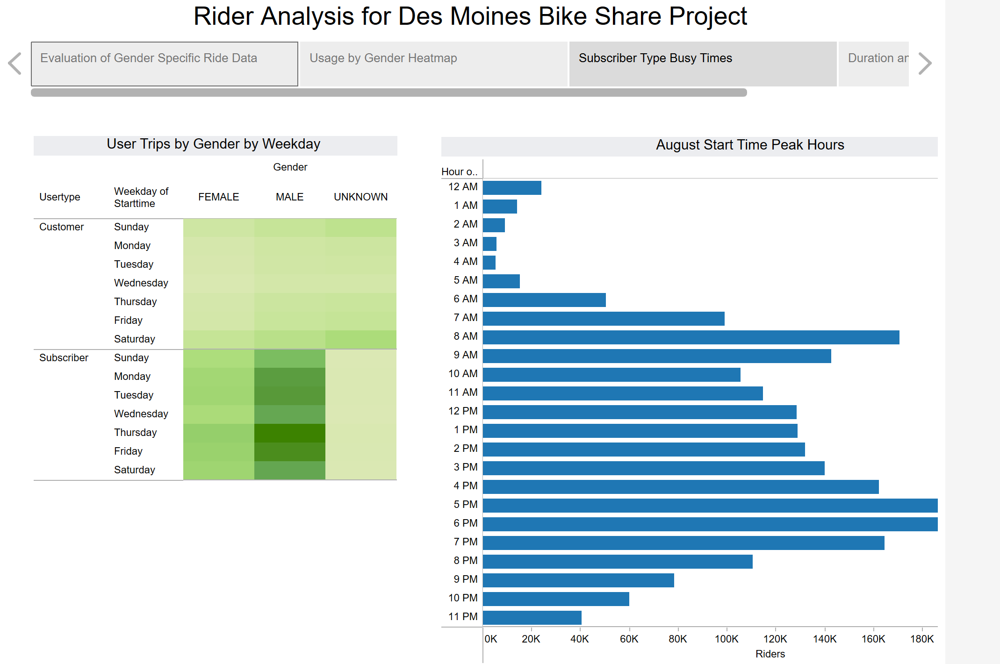

# Analysis of NYC Bike Sharing Rides (August 2019) for Des Moines Project Research

## Overview

Citibike wants to expand to Des Moines.  We've decided to look at NYC Citibike Rideshare data from August 2019 to try and determine the types of ridership and rides to expect during this time of year. In this analysis, we focus on the days/times that are most popular and the characteristics of the ridership.  We created a Tableau story to show applicable charts of the data which is available [here](https://public.tableau.com/app/profile/amy.k.stelling/viz/bikesharing_story/AnalysisStory).

## Results

This story highlights some key points about the ridership.  On this "Subscriber Type Busy Times Tab", you can see that the busy times on the heat map and bar chart for both males and females is typical weekday before work and after work times.  The heatmap highlights that the Subscribers are the heaviest users during those times.  

In the 

