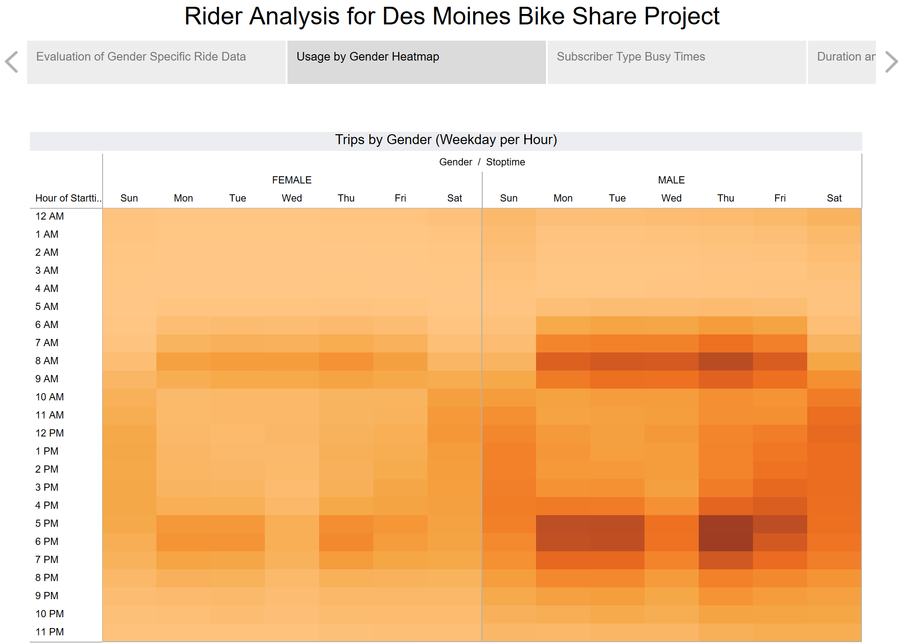
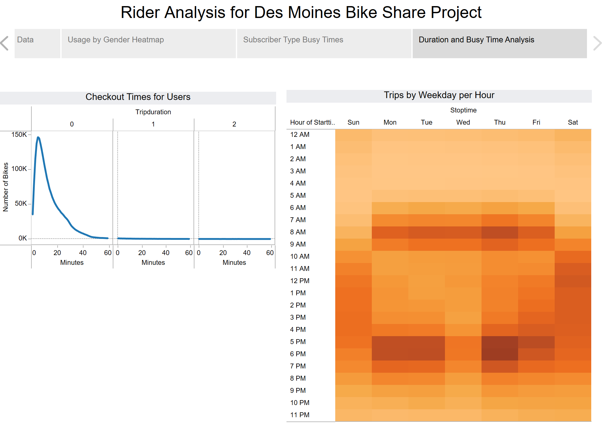
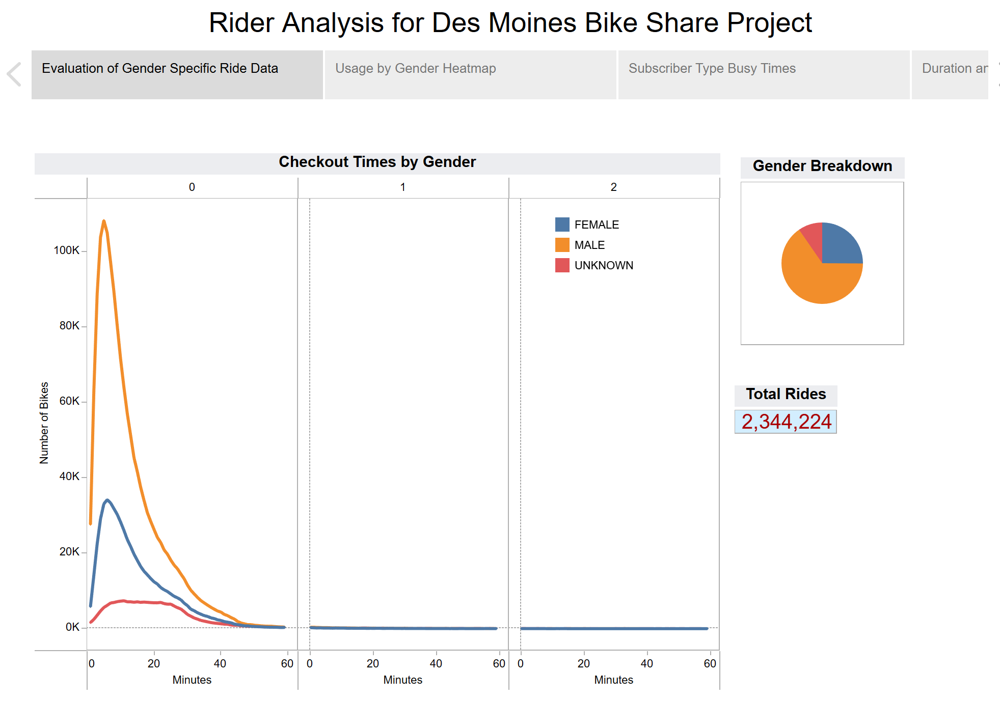

# Des Moines Project Research
## Analysis of NYC Bike Sharing Rides (August 2019) 

### Overview

Citibike wants to expand to Des Moines.  We've decided to look at NYC Citibike Rideshare data from August 2019 to try and determine the types of ridership and rides to expect during this time of year. In this analysis, we focus on the days/times that are most popular and the characteristics of the ridership.  We created a Tableau story to show applicable charts of the data which is available [here](https://public.tableau.com/app/profile/amy.k.stelling/viz/bikesharing_story/AnalysisStory).

### Results

This story highlights some key points about the ridership.  On this "Subscriber Type Busy Times Tab" seen below, you can see that the busy times on the heat map and bar chart for both males and females is typical weekday before work and after work times.  The heatmap highlights that the Subscribers are the heaviest users during those times.  

On the Usage by Gender Heat Map below, you can also see that males use the rideshare more than females but both have the patterrn of heavy usage before and after daytime work hours.

Looking at the Duration of Rides and the Busy times, you can see that most rides are less than 30-minutes.  Those rides, are typically during before/after work during the workdays and mid-morning to early evening on the weekends.  

Finally, when we look at the duration by gender and the overall difference between male/female/unknown riders, you can see that there are more male riders but the duration pattern seems the same between the genders.

